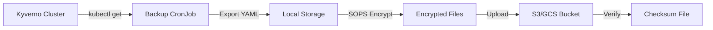

# Kyverno Policy Backup Strategy

**Version:** 1.0  
**Created:** 2026-08-07  
**Last Updated:** 2026-08-07  
**Owner:** DevOps Engineer

---

## Overview

This document describes the backup strategy for Kyverno policies in the openDesk Edu Kubernetes cluster.

### Why Backup Kyverno Policies?

- **Disaster Recovery**: Restore policies after cluster failure
- **Audit Trail**: Maintain history of policy changes
- **Compliance**: Meet ZKI-IT-Grundschutz requirements
- **Change Management**: Rollback problematic policy changes

---

## Backup Architecture



---

## Backup Schedule

| Backup Type | Schedule | Retention | Location |
|-------------|----------|-----------|----------|
| **Full Backup** | Daily at 2 AM | 90 days | S3/GCS |
| **Pre-Change Backup** | Before each policy change | 1 year | S3/GCS |
| **Manual Backup** | On-demand | 1 year | S3/GCS |

---

## Backup Contents

Each backup includes:

1. **ClusterPolicies** - Cluster-wide Kyverno policies
2. **Policies** - Namespace-specific policies
3. **PolicyReports** - Compliance reports
4. **ClusterPolicyReports** - Cluster-wide compliance reports
5. **Associated Resources** - Related ConfigMaps, Secrets, RBAC

---

## Implementation

### Automated Daily Backup

The backup is automated via a Kubernetes CronJob:

```bash
# Deploy backup CronJob
kubectl apply -f k8s/security/policy-backup/kyverno-policy-backup-cronjob.yaml

# Verify CronJob is running
kubectl get cronjob -n kyverno-backup
kubectl get pods -n kyverno-backup -l app.kubernetes.io/name=kyverno-policy-backup
```

### Manual Backup

```bash
# Create manual backup
kubectl run kyverno-backup-manual \
  --namespace=kyverno-backup \
  --image=opendesk-edu/backup-tools:latest \
  --restart=OnFailure \
  --command -- /bin/sh -c "\
    TIMESTAMP=\$(date +%Y%m%d-%H%M%S) && \
    kubectl get clusterpolicies -o yaml > /backup/clusterpolicies-\${TIMESTAMP}.yaml && \
    kubectl get policies --all-namespaces -o yaml > /backup/policies-\${TIMESTAMP}.yaml && \
    sops --encrypt /backup/clusterpolicies-\${TIMESTAMP}.yaml > /backup/clusterpolicies-\${TIMESTAMP}.yaml.enc && \
    aws s3 cp /backup/clusterpolicies-\${TIMESTAMP}.yaml.enc s3://opendesk-backup/kyverno/"
```

### Pre-Change Backup

Before making any policy changes:

```bash
# Create pre-change backup
./k8s/security/emergency/pre-change-backup.sh "Adding new image verification policy"
```

---

## Encryption

### SOPS Configuration

All backups are encrypted using SOPS (Secrets OPerationS) with Age encryption:

```bash
# Generate Age key
age-keygen -o age.key

# Export key for SOPS
export SOPS_AGE_KEY=$(cat age.key)

# Encrypt backup
sops --encrypt backup.yaml > backup.yaml.enc

# Decrypt backup
sops --decrypt backup.yaml.enc > backup.yaml
```

### Key Management

- **Age Keys**: Stored in Kubernetes Secrets
- **Key Rotation**: Every 90 days
- **Backup**: Keys stored in secure offline storage

---

## Storage

### Cloud Storage

Backups are stored in cloud storage with the following structure:

```
s3://opendesk-backup/kyverno/
├── kyverno-full-backup-20260807-020000.yaml.enc
├── kyverno-full-backup-20260807-020000.yaml.enc.sha256
├── kyverno-full-backup-20260806-020000.yaml.enc
├── kyverno-full-backup-20260806-020000.yaml.enc.sha256
└── ...
```

### Retention Policy

- **Daily Backups**: 90 days
- **Pre-Change Backups**: 1 year
- **Manual Backups**: 1 year

Cleanup is automated via the backup CronJob.

---

## Restore Procedure

### Prerequisites

- Access to Kubernetes cluster
- SOPS decryption key
- Cloud storage credentials

### Step-by-Step Restore

1. **Identify Backup to Restore**

```bash
# List available backups
aws s3 ls s3://opendesk-backup/kyverno/ | grep ".enc$"
```

2. **Download Backup**

```bash
aws s3 cp s3://opendesk-backup/kyverno/kyverno-full-backup-20260807-020000.yaml.enc ./backup.enc
```

3. **Verify Checksum**

```bash
aws s3 cp s3://opendesk-backup/kyverno/kyverno-full-backup-20260807-020000.yaml.enc.sha256 ./backup.sha256
sha256sum -c backup.sha256
```

4. **Decrypt Backup**

```bash
sops --decrypt backup.enc > backup.yaml
```

5. **Apply Policies**

```bash
kubectl apply -f backup.yaml
```

6. **Verify Restoration**

```bash
kubectl get clusterpolicies
kubectl get policies --all-namespaces
```

### Automated Restore

Use the restore Job template:

```bash
# Modify and apply restore job
kubectl apply -f k8s/security/policy-backup/kyverno-policy-restore-job.yaml

# Monitor restore progress
kubectl logs -f job/kyverno-policy-restore
```

---

## Testing

### Monthly Restore Test

Perform monthly restore tests to ensure backup integrity:

```bash
# Schedule monthly test (first Monday of each month)
kubectl create job --from=cronjob/kyverno-policy-backup \
  kyverno-backup-test-\$(date +%Y%m)

# Verify test results
kubectl logs job/kyverno-backup-test-202608
```

### Test Checklist

- [ ] Backup file downloads successfully
- [ ] Checksum verification passes
- [ ] SOPS decryption works
- [ ] YAML syntax is valid
- [ ] Policies apply without errors
- [ ] Cluster state matches backup

---

## Monitoring & Alerts

### Prometheus Alerts

```yaml
# kyverno-backup-alerts.yaml
apiVersion: monitoring.coreos.com/v1
kind: PrometheusRule
metadata:
  name: kyverno-backup-alerts
spec:
  groups:
    - name: kyverno-backup
      rules:
        - alert: KyvernoBackupFailed
          expr: increase(kube_job_status_failed{namespace="kyverno-backup"}[1h]) > 0
          for: 15m
          labels:
            severity: warning
          annotations:
            summary: "Kyverno backup job failed"
        
        - alert: KyvernoBackupNotRun
          expr: time() - kube_job_created{namespace="kyverno-backup"} > 86400
          for: 6h
          labels:
            severity: critical
          annotations:
            summary: "Kyverno backup has not run in 24 hours"
```

### Alert Channels

| Severity | Channel | Response Time |
|----------|---------|---------------|
| **Critical** | PagerDuty | < 15 min |
| **Warning** | Slack #ops-alerts | < 1 hour |
| **Info** | Email | < 24 hours |

---

## Compliance Mapping

| ZKI-Anforderung | BSI-Baustein | Backup Implementation |
|-----------------|--------------|----------------------|
| INF.1.A15 | Audit | Backup logs for audit trail |
| INF.7.A1 | Notfallmanagement | Restore procedures documented |
| INF.7.A2 | Notfallvorsorge | Automated daily backups |
| INF.7.A3 | Notfallvorsorge Testing | Monthly restore tests |

---

## Troubleshooting

### Backup Job Fails

```bash
# Check job logs
kubectl logs -n kyverno-backup -l job-name=kyverno-policy-backup-xxxxx

# Check previous successful backup
kubectl get jobs -n kyverno-backup | grep kyverno-policy-backup

# Manually trigger backup
kubectl create job --from=cronjob/kyverno-policy-backup manual-backup
```

### Restore Fails

```bash
# Verify checksum
sha256sum -c backup.sha256

# Check SOPS key
sops --decrypt --test backup.enc

# Validate YAML syntax
kubectl apply --dry-run=client -f backup.yaml
```

### Storage Issues

```bash
# Check S3 bucket access
aws s3 ls s3://opendesk-backup/

# Check GCS bucket access
gcloud storage ls gs://opendesk-backup/

# Verify credentials
aws sts get-caller-identity
```

---

## Contact

| Role | Contact | Escalation |
|------|---------|------------|
| DevOps Engineer | devops@opendesk-edu.org | L2 |
| Security Engineer | security@opendesk-edu.org | L2 |
| Projektleitung | tobias.weiss@hrz.uni-marburg.de | L3 |

---

## Revision History

| Version | Date | Changes | Author |
|---------|------|---------|--------|
| 1.0 | 2026-08-07 | Initial version | Tobias Weiß |

---

**End of Document**
