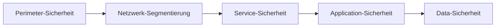
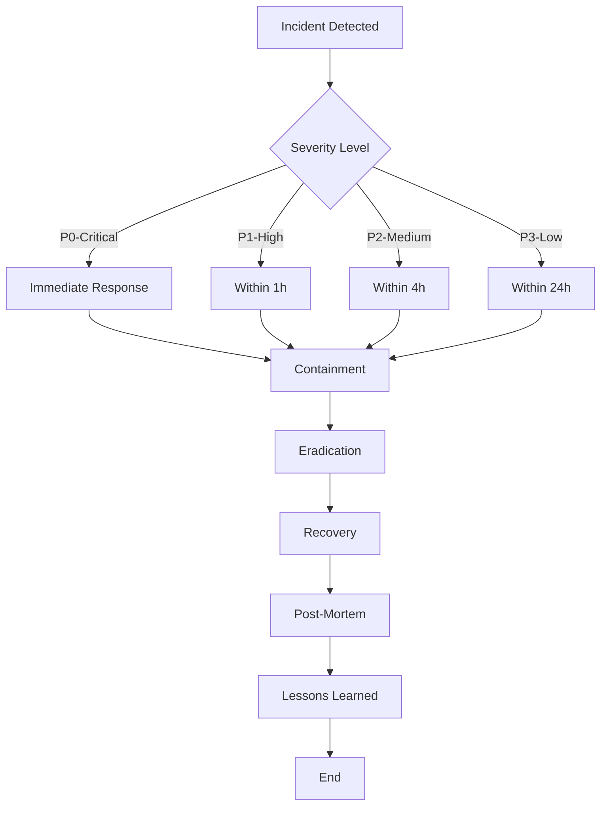
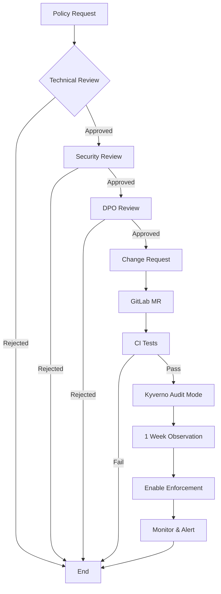

# Sicherheitsleitlinie openDesk Edu

**Version:** 1.0  
**Status:** ⏳ DPO Review  
**Erstellt:** 2026-08-07  
**Gültig ab:** [Genehmigung durch DPO/Justiziariat]  
**Verantwortlich:** Projektleitung openDesk Edu

---

## 1. Einleitung

### 1.1 Zweck dieser Leitlinie

Diese Sicherheitsleitlinie definiert die grundlegenden Sicherheitsanforderungen und -maßnahmen für die openDesk Edu-Plattform, eine hochschulische Digital-Workplace-Lösung.

Die Leitlinie dient als:
- **Richtlinie** für technische Implementierungen
- **Prüfmaßstab** für Compliance-Audits
- **Entscheidungsgrundlage** für Sicherheitsvorfälle
- **Dokumentationsbasis** für DPO und Justiziariat

### 1.2 Geltungsbereich

Diese Leitlinie gilt für:
- **Alle openDesk Edu-Instanzen** (HRZ Marburg, Partner-Hochschulen)
- **Alle Komponenten** (Container, Services, Infrastruktur)
- **Alle Beteiligten** (Entwickler, Betrieb, Nutzer)
- **Alle Lebenszyklus-Phasen** (Entwicklung, Betrieb, Außerbetriebnahme)

### 1.3 Referenzdokumente

| Dokument | Version | Bezug |
|----------|---------|-------|
| BSI IT-Grundschutz-Kompendium | 2026 | Basis-Sicherheitsanforderungen |
| ZKI IT-Grundschutz-Profil für Hochschulen | 2025 | Hochschulspezifische Anpassungen |
| DSGVO | - | Datenschutzrechtliche Anforderungen |
| ISO/IEC 27001:2022 | - | Informationssicherheits-Managementsystem |
| openDesk Edu ZKI-Compliance Article | 2026 | Technische Umsetzung |

---

## 2. Sicherheitsprinzipien

### 2.1 Defense in Depth

Mehrere Sicherheitsebenen werden implementiert:



**Umsetzung:**
- **Perimeter:** Firewall, WAF, DDoS-Schutz
- **Netzwerk:** Network Policies, mTLS, Segmentierung
- **Service:** Container Hardening, Least Privilege
- **Application:** Input Validation, Authentication, Authorization
- **Data:** Encryption at Rest, Backup, Access Control

### 2.2 Least Privilege

Jede Komponente erhält nur die minimal notwendigen Rechte.

**Umsetzung:**
- Kubernetes RBAC mit minimalen Permissions
- Container als Non-Root User
- Keine unnötigen Capabilities
- Secret Management mit Zugriffskontrolle

### 2.3 Zero Trust

Keine implizite Vertrauensstellung, alle Zugriffe werden verifiziert.

**Umsetzung:**
- mTLS für Service-to-Service-Kommunikation
- JWT-basierte Authentifizierung
- Continuous Authorization Checks
- Audit Logging aller Zugriffe

### 2.4 Security by Design

Sicherheit ist integraler Bestandteil des Entwicklungsprozesses.

**Umsetzung:**
- Security Requirements im Design
- Automated Security Testing in CI/CD
- Security Reviews vor Releases
- Vulnerability Management Prozess

---

## 3. Identitäts- und Zugriffsmanagement (IAM)

### 3.1 Authentifizierung

**Anforderungen:**
- [x] Zentrale Identity Provider (Keycloak)
- [x] SAML 2.0 / OIDC Support
- [x] Multi-Faktor-Authentifizierung (MFA) optional
- [x] Session Management mit Timeout
- [ ] Adaptive Authentication (Phase 2)

**Umsetzung:**
```yaml
# Keycloak Configuration
realm: opendesk-edu
authenticationFlows:
  - browser:
      - username-password-form
      - otp-form (optional)
  - direct-grant:
      - direct-grant-validate-username
      - direct-grant-validate-password
```

### 3.2 Autorisierung

**Anforderungen:**
- [x] Role-Based Access Control (RBAC)
- [x] Service-Level Permissions
- [x] Namespace Isolation
- [x] Kyverno Policies für Enforcement

**Rollen-Modell:**
| Rolle | Beschreibung | Berechtigungen |
|-------|--------------|----------------|
| `admin` | Vollzugriff | Alle Operations |
| `operator` | Betrieb | Deploy, Monitor, Backup |
| `developer` | Entwicklung | Read, Test Deploy |
| `user` | Endnutzer | Service Access |
| `auditor` | Compliance | Read Logs, Reports |

### 3.3 Service Accounts

**Anforderungen:**
- [x] Separate Service Accounts pro Namespace
- [x] Minimal Permissions
- [x] Rotation alle 90 Tage
- [x] Audit Logging

---

## 4. Netzwerksicherheit

### 4.1 Netzwerksegmentierung

**Anforderungen:**
- [x] Namespace-basierte Isolation
- [x] Network Policies für alle Namespaces
- [x] Default-Deny Policies
- [ ] Micro-Segmentation (Phase 2)

**Network Policy Template:**
```yaml
apiVersion: networking.k8s.io/v1
kind: NetworkPolicy
metadata:
  name: default-deny-all
  namespace: opendesk
spec:
  podSelector: {}
  policyTypes:
    - Ingress
    - Egress
```

### 4.2 Verschlüsselung

**Anforderungen:**
- [x] TLS 1.3 für alle externen Verbindungen
- [x] mTLS für Service-to-Service (Phase 2)
- [x] Encryption at Rest für Datenbanken
- [x] Secrets verschlüsselt speichern

**TLS-Konfiguration:**
```yaml
# Ingress TLS
spec:
  tls:
    - hosts:
        - "*.opendesk-edu.org"
      secretName: opendesk-tls-secret
  rules:
    - host: "*.opendesk-edu.org"
      http:
        paths:
          - pathType: Prefix
            path: "/"
            backend:
              service: ...
```

### 4.3 Perimeter-Sicherheit

**Anforderungen:**
- [ ] WAF (Web Application Firewall)
- [ ] DDoS-Schutz
- [ ] Rate Limiting
- [ ] Geo-Blocking (optional)

---

## 5. Container-Sicherheit

### 5.1 Image-Sicherheit

**Anforderungen:**
- [x] Private Registry nur mit Authentifizierung
- [x] Image Signing mit Cosign
- [x] Vulnerability Scanning vor Deployment
- [x] SBOM-Generierung (SPDX, CycloneDX)
- [x] Kyverno Policy für Image-Verification

**Image-Verification Policy:**
```yaml
apiVersion: kyverno.io/v1beta1
kind: ClusterPolicy
metadata:
  name: verify-images
spec:
  validationFailureAction: enforce
  rules:
    - name: check-signatures
      match:
        resources:
          kinds:
            - Pod
      verifyImages:
        - registry: registry.opencode.de/umr/opendesk-edu/opendesk-nix/
          attestations:
            - predicateType: "https://slsa.dev/provenance/v0.2"
```

### 5.2 Runtime-Sicherheit

**Anforderungen:**
- [x] Non-Root Container
- [x] Read-Only Root Filesystem
- [x] Drop All Capabilities
- [x] Resource Limits
- [ ] Runtime Security Monitoring (Phase 2)

**Security Context:**
```yaml
securityContext:
  runAsNonRoot: true
  runAsUser: 1000
  runAsGroup: 1000
  fsGroup: 1000
  readOnlyRootFilesystem: true
  allowPrivilegeEscalation: false
  capabilities:
    drop:
      - ALL
```

### 5.3 Supply Chain Security

**Anforderungen:**
- [x] SLSA Level 3 für alle Images
- [x] Reproducible Builds
- [x] Attestation Storage
- [x] Supply Chain Policy Enforcement

---

## 6. Datensicherheit

### 6.1 Datenklassifizierung

| Klasse | Beschreibung | Beispiele | Schutzmaßnahmen |
|--------|--------------|-----------|-----------------|
| **Öffentlich** | Öffentlich zugänglich | Website, Blog | Standard-Sicherheit |
| **Intern** | Nur für Hochschule | Interne Dokumente | Access Control |
| **Vertraulich** | Sensible Daten | Personendaten | Encryption, Audit |
| **Streng vertraulich** | Hochsensibel | Gesundheitsdaten | Additional Controls |

### 6.2 Datenverschlüsselung

**Anforderungen:**
- [x] Encryption in Transit (TLS)
- [x] Encryption at Rest (Database)
- [x] Secrets Management (Vault/Sealed Secrets)
- [ ] Field-Level Encryption (Phase 2)

### 6.3 Backup & Recovery

**Anforderungen:**
- [x] Tägliche Backups aller Datenbanken
- [x] Backup-Verschlüsselung
- [x] Georedundante Speicherung
- [x] Restore-Testing monatlich
- [x] RTO < 4h, RPO < 1h

**Backup-Strategie:**
```yaml
# Database Backup CronJob
spec:
  schedule: "0 2 * * *"  # Daily at 2 AM
  successfulJobsHistoryLimit: 30  # 30 days retention
  failedJobsHistoryLimit: 7
```

---

## 7. Compliance & Audit

### 7.1 ZKI IT-Grundschutz

**Umsetzung der 111-Punkte-Checkliste:**

| Kategorie | Punkte | Status |
|-----------|--------|--------|
| IAM & Authentifizierung | 15 | 🟡 60% |
| Netzwerksicherheit | 20 | 🟡 70% |
| Container-Sicherheit | 25 | 🟢 85% |
| Datensicherheit | 18 | 🟡 65% |
| Compliance & Audit | 15 | 🟡 50% |
| Notfallmanagement | 10 | 🔴 30% |
| **Gesamt** | **111** | **🟡 62%** |

**Automatisierte Compliance-Checks:**
```bash
# Daily Compliance Scan
kubectl apply -f k8s/operators/compliance-operator/compliance-instance.yaml
# Report generated at 2 AM daily
```

### 7.2 Audit Logging

**Anforderungen:**
- [x] Alle Zugriffe loggen
- [x] Zentrale Log-Aggregation (Loki)
- [x] Log-Retention 12 Monate
- [x] SIEM-Integration (Phase 2)
- [x] Anomalie-Erkennung (Phase 2)

**Audit-Log-Schema:**
```json
{
  "timestamp": "2026-08-07T10:30:00Z",
  "actor": "user@example.org",
  "action": "create",
  "resource": "pod",
  "namespace": "opendesk",
  "name": "mariadb-0",
  "result": "success",
  "reason": "User created pod via kubectl"
}
```

### 7.3 Vulnerability Management

**Anforderungen:**
- [x] Tägliche Vulnerability Scans
- [x] Grype, Trivy, Snyk Integration
- [x] SBOM-Generierung
- [x] Critical: 24h, High: 7d, Medium: 30d Remediation
- [ ] Automated Patching (Phase 2)

**Scan-Pipeline:**
```yaml
# CI/CD Pipeline
stages:
  - build
  - scan:
      - grype
      - trivy
      - snyk
  - sign:
      - cosign
  - push
```

---

## 8. Notfallmanagement

### 8.1 Incident Response

**Prozess:**



**Eskalationsmatrix:**

| Level | Situation | Response Time | Kontakt |
|-------|-----------|---------------|---------|
| **P0** | Service Down, Security Breach | < 15 min | On-Call + Projektleitung |
| **P1** | Degraded Performance | < 1h | On-Call |
| **P2** | Single Feature Broken | < 4h | DevOps Team |
| **P3** | Minor Issue | < 24h | Ticket System |

### 8.2 Disaster Recovery

**Anforderungen:**
- [x] Backup-Strategie implementiert
- [x] Restore-Prozeduren dokumentiert
- [x] DR-Testing vierteljährlich
- [ ] Active-Active Failover (Phase 2)
- [ ] Multi-Region Deployment (Phase 3)

**RTO/RPO:**

| Service | RTO | RPO |
|---------|-----|-----|
| Groupware (SOGo, Stalwart) | 4h | 1h |
| Files (openCloud) | 4h | 1h |
| Databases | 2h | 30min |
| Monitoring | 8h | 24h |

### 8.3 Kyverno Policy Notfall-Abschaltung

**Siehe:** `IMPLEMENTATION-PLAN-PRIORITY-1.md` (Abschnitt 1.5)

---

## 9. Governance

### 9.1 Policy Change Management

**Prozess:**



**Siehe auch:** `IMPLEMENTATION-PLAN-PRIORITY-1.md` (Abschnitt 1.4)

### 9.2 Review-Zyklus

| Review-Typ | Frequenz | Verantwortlich |
|------------|----------|----------------|
| Security Review | Vor jedem Release | Security Engineer |
| Compliance Review | Monatlich | Compliance Officer |
| DPO Review | Quartalsweise | DPO |
| Policy Review | Halbjährlich | Projektleitung |
| Full Audit | Jährlich | Externer Auditor |

### 9.3 Rollen & Verantwortlichkeiten

| Rolle | Verantwortung | Besetzung |
|-------|---------------|-----------|
| Projektleitung | Gesamtverantwortung | Tobias Weiß |
| Security Engineer | Security Implementation | TBD |
| DevOps Engineer | Operations | TBD |
| Compliance Officer | ZKI Compliance | TBD |
| DPO | Datenschutz | HRZ Datenschutz |
| Justiziariat | Rechtliche Prüfung | Rechtsamt Marburg |

---

## 10. Anhang

### 10.1 Glossar

| Begriff | Definition |
|---------|------------|
| **mTLS** | Mutual TLS - gegenseitige Authentifizierung |
| **RBAC** | Role-Based Access Control |
| **SBOM** | Software Bill of Materials |
| **SLSA** | Supply Chain Levels for Software Artifacts |
| **RTO** | Recovery Time Objective |
| **RPO** | Recovery Point Objective |

### 10.2 Versionshistorie

| Version | Datum | Änderungen | Autor |
|---------|-------|------------|-------|
| 1.0 | 2026-08-07 | Initial Version | Tobias Weiß |
| 1.1 | TBD | DPO-Feedback integriert | TBD |

### 10.3 Genehmigungen

| Stelle | Genehmigt | Datum | Unterschrift |
|--------|-----------|-------|--------------|
| Projektleitung | ⏳ Pending | - | - |
| DPO | ⏳ Pending | - | - |
| Justiziariat | ⏳ Pending | - | - |

---

## 11. Kontakt

**Projektleitung:**
- Name: Tobias Weiß
- Email: tobias.weiss@hrz.uni-marburg.de
- Telefon: +49 6421 28-XXXX

**HRZ Datenschutz:**
- Email: datenschutz@hrz.uni-marburg.de
- Telefon: +49 6421 28-XXXX

**Rechtsamt Marburg:**
- Email: rechtsamt@uni-marburg.de
- Telefon: +49 6421 28-XXXX

---

**Ende der Sicherheitsleitlinie**
