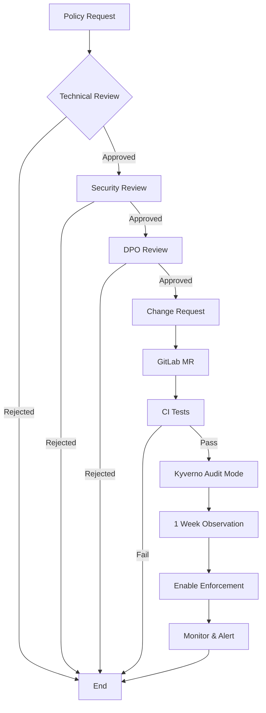

# openDesk Edu - Implementierungsplan Priorität 1

**Status:** 🟡 In Vorbereitung  
**Erstellt:** 2026-08-07  
**Ziel:** Produktionsbereitstellung innerhalb von 4-6 Wochen

---

## 📋 Übersicht

| Bereich | Aufwand | Deadline | Status |
|---------|---------|----------|--------|
| ZKI-Compliance P0 | 4-6 Wochen | 2026-09-15 | ⏳ Pending |
| K3s-Produktionsdeployment | 1-2 Wochen | 2026-08-21 | ⏳ Pending |
| DevGuard Phase 4-5 | 2-3 Wochen | 2026-08-31 | 🟡 In Progress |

---

## 🎯 Bereich 1: ZKI-Compliance P0-Arbeiten

### 1.1 DPO/Justiziariat-Genehmigung Sicherheitsleitlinie

**Aufwand:** 2-4 Wochen (abhängig von Genehmigungsprozess)  
**Verantwortlich:** Projektleitung + Rechtsteam

#### Aufgaben

| ID | Aufgabe | Dauer | Output |
|----|---------|-------|--------|
| P0-LEGAL-01 | Sicherheitsleitlinie finalisieren | 3 Tage | `docs/SECURITY_POLICY.md` |
| P0-LEGAL-02 | DPO-Review anfordern | 1 Tag | E-Mail an DPO |
| P0-LEGAL-03 | Justiziariat-Review | 1-2 Wochen | Feedback |
| P0-LEGAL-04 | Änderungen implementieren | 1-2 Wochen | Version 2.0 |
| P0-LEGAL-05 | Final sign-off | 1 Woche | Unterschrift |

#### Checkliste

- [ ] Sicherheitsleitlinie Version 1.0 in `docs/SECURITY_POLICY.md`
- [ ] DPO-Kontakt identifiziert (HRZ: datenschutz@hrz.uni-marburg.de)
- [ ] Justiziariat-Kontakt identifiziert (Rechtsamt Marburg)
- [ ] Review-Meeting geplant
- [ ] Feedback-Tracking eingerichtet

#### Vorlage: DPO-Anfrage

```markdown
Betreff: Review Sicherheitsleitlinie openDesk Edu - ZKI-IT-Grundschutz Compliance

Sehr geehrte Damen und Herren,

wir bitten um rechtliches Review der Sicherheitsleitlinie für openDesk Edu,
einer hochschulischen Digital-Workplace-Plattform.

Die Leitlinie ist ausgerichtet auf:
- BSI-IT-Grundschutz (aktuelle Version)
- ZKI-IT-Grundschutz-Profil für Hochschulen
- DSGVO-Konformität
- ISO/IEC 27001:2022

Anhang: docs/SECURITY_POLICY.md

Bitte um Review bis [Datum].

Mit freundlichen Grüßen
openDesk Edu Team
```

---

### 1.2 Kyverno-Webhook-Authentifizierung

**Aufwand:** 1-2 Wochen  
**Verantwortlich:** Security Engineer

#### Aufgaben

| ID | Aufgabe | Dauer | Output |
|----|---------|-------|--------|
| P0-KYV-01 | CA-Zertifikat generieren | 1 Tag | `ca.crt`, `ca.key` |
| P0-KYV-02 | Server-Zertifikat für Kyverno | 1 Tag | `kyverno.crt`, `kyverno.key` |
| P0-KYV-03 | Client-Zertifikate für Admission | 1 Tag | `admission-client.crt`, `admission-client.key` |
| P0-KYV-04 | Kyverno-Deployment aktualisieren | 2 Tage | TLS-Webhook-Konfiguration |
| P0-KYV-05 | Validierung im Test-Cluster | 3 Tage | Test-Report |
| P0-KYV-06 | Produktions-Deployment | 1 Tag | Production Ready |

#### Technische Details

```yaml
# kyverno-webhook-config.yaml
apiVersion: admissionregistration.k8s.io/v1
kind: ValidatingWebhookConfiguration
metadata:
  name: kyverno-validation-webhook
webhooks:
  - name: validate.kyverno.svc
    clientConfig:
      caBundle: <base64-encoded-ca.crt>
      url: https://kyverno.kyverno.svc:443/validate
    rules:
      - apiGroups: ["*"]
        apiVersions: ["*"]
        resources: ["*"]
    admissionReviewVersions: ["v1"]
    sideEffects: None
    timeoutSeconds: 5
```

#### ZKI-Compliance Mapping

| Anforderung | BSI-Baustein | Kyverno-Umsetzung |
|-------------|--------------|-------------------|
| INF.1.A10 | Zugriffskontrolle | Client-Zertifikate für Webhook |
| INF.5.A1 | Netzwerksicherheit | TLS für alle Webhook-Kommunikation |
| INF.1.A15 | Audit | Webhook-Logs im SIEM |

---

### 1.3 Kyverno-Policy-Backup

**Aufwand:** 1 Woche  
**Verantwortlich:** DevOps Engineer

#### Aufgaben

| ID | Aufgabe | Dauer | Output |
|----|---------|-------|--------|
| P0-BACKUP-01 | Backup-Strategie definieren | 1 Tag | `docs/POLICY-BACKUP.md` |
| P0-BACKUP-02 | CronJob für Policy-Export | 2 Tage | `k8s/kyverno-policy-backup.yaml` |
| P0-BACKUP-03 | SOPS-Verschlüsselung | 1 Tag | Encrypted Backups |
| P0-BACKUP-04 | Restore-Testing | 2 Tage | Restore-Runbook |
| P0-BACKUP-05 | Monitoring-Alerts | 1 Tag | Prometheus Alerts |

#### Backup-Skript

```bash
#!/bin/bash
# kyverno-policy-backup.sh

# Export all Kyverno policies
kubectl get clusterpolicies -o yaml > /backup/kyverno-policies-$(date +%Y%m%d).yaml

# Encrypt with SOPS
sops --encrypt --pgp <KEY_ID> /backup/kyverno-policies-*.yaml > /backup/kyverno-policies-*.yaml.enc

# Upload to S3/GCS
aws s3 cp /backup/kyverno-policies-*.yaml.enc s3://opendesk-backup/kyverno/

# Cleanup local
rm /backup/kyverno-policies-*.yaml
```

#### Kubernetes CronJob

```yaml
apiVersion: batch/v1
kind: CronJob
metadata:
  name: kyverno-policy-backup
  namespace: kyverno
spec:
  schedule: "0 2 * * *"  # Daily at 2 AM
  jobTemplate:
    spec:
      template:
        spec:
          containers:
          - name: backup
            image: opendesk-edu/backup-tools:latest
            command: ["/backup/kyverno-policy-backup.sh"]
            volumeMounts:
            - name: backup-volume
              mountPath: /backup
          volumes:
          - name: backup-volume
            persistentVolumeClaim:
              claimName: kyverno-backup-pvc
          restartPolicy: OnFailure
```

---

### 1.4 Policy-Change-Management-Prozess

**Aufwand:** 1 Woche  
**Verantwortlich:** Security Engineer + DevOps

#### Workflow



#### Policy-Change-Request-Template

```markdown
# Policy Change Request

## Requester
- Name: 
- Email:
- Department:

## Change Details
- Policy Name:
- Change Type: [New/Modify/Delete]
- Priority: [P0/P1/P2]
- Description:

## Technical Impact
- Affected Services:
- Affected Namespaces:
- Risk Assessment:

## Security Review
- Reviewed By:
- Date:
- Comments:

## DPO Review
- Reviewed By:
- Date:
- Comments:

## Approval
- Approved By:
- Date:
- Change Window:
```

---

### 1.5 Notfall-Abschaltverfahren für Policies

**Aufwand:** 1 Woche  
**Verantwortlich:** DevOps Engineer + Security Engineer

#### Eskalationsmatrix

| Level | Situation | Aktion | Zeitrahmen |
|-------|-----------|--------|------------|
| **L1** | Einzelne Policy blockiert legitime Deployment | Policy im Audit Mode | 1 Stunde |
| **L2** | Mehrere Policies blockieren kritische Services | Policy im Namespace disable | 30 Minuten |
| **L3** | Kyverno-Webhook-Fehler blockiert alle Deployments | Kyverno-Webhook bypass | 15 Minuten |
| **L4** | Sicherheitskritischer Vorfall | Alle Policies enforce | Sofort |

#### Notfall-Skripte

```bash
#!/bin/bash
# emergency-policy-disable.sh

# Level 1: Set specific policy to audit mode
kubectl patch clusterpolicy <POLICY_NAME> -p '{"spec":{"validationFailureAction":"audit"}}'

# Level 2: Disable policy in specific namespace
kubectl label namespace <NAMESPACE> kyverno-exclude=true

# Level 3: Bypass Kyverno webhook (EMERGENCY ONLY)
kubectl patch validatingwebhookconfiguration kyverno-validation-webhook --type='json' -p='[{"op": "replace", "path": "/webhooks/0/failurePolicy", "value":"Ignore"}]'

# Level 4: Re-enable all policies
kubectl patch clusterpolicy <POLICY_NAME> -p '{"spec":{"validationFailureAction":"enforce"}}'
kubectl label namespace <NAMESPACE> kyverno-exclude-
kubectl patch validatingwebhookconfiguration kyverno-validation-webhook --type='json' -p='[{"op": "replace", "path": "/webhooks/0/failurePolicy", "value":"Fail"}]'
```

#### Runbook

1. **Eskalation erkennen**: Monitoring-Alerts + Incident-Management-System
2. **Level bestimmen**: Nach Eskalationsmatrix
3. **Aktion durchführen**: Notfall-Skript ausführen
4. **Dokumentieren**: Incident-Log aktualisieren
5. **Post-Mortem**: Root-Cause-Analyse innerhalb von 48h

---

## 🚀 Bereich 2: K3s-Produktionsdeployment

### 2.1 Registry-Authentication Fix

**Aufwand:** 1 Tag  
**Verantwortlich:** DevOps Engineer

#### Aufgaben

| ID | Aufgabe | Dauer | Output |
|----|---------|-------|--------|
| P1-REG-01 | GitLab PAT mit read_registry Scope erstellen | 30 min | New Token |
| P1-REG-02 | Image Pull Secret aktualisieren | 15 min | Updated Secret |
| P1-REG-03 | Deploy to K3s Test Cluster | 1 Stunde | Test Deployment |
| P1-REG-04 | Validate Image Pull | 30 min | Success Report |
| P1-REG-05 | Deploy to K3s Production | 1 Stunde | Production Ready |

#### GitLab PAT erstellen

```bash
# Via GitLab API
curl -X POST \
  -H "Authorization: Bearer $ADMIN_TOKEN" \
  -H "Content-Type: application/json" \
  -d '{"name":"opendesk-deployment","scopes":["read_registry","api"]}' \
  https://gitlab.opencode.de/api/v4/user/personal_access_tokens
```

#### Secret aktualisieren

```bash
# Generate new base64-encoded secret
NEW_TOKEN="<new-token>"
USERNAME="tobias.weiss"
DOCKER_CONFIG=$(echo -n "{\"auths\":{\"registry.opencode.de\":{\"username\":\"$USERNAME\",\"password\":\"$NEW_TOKEN\",\"auth\":\"$(echo -n \"$USERNAME:$NEW_TOKEN\" | base64 -w0)\"}}}" | base64 -w0)

# Update secret
kubectl create secret docker-registry opencode-registry-pull-secret \
  --docker-server=registry.opencode.de \
  --docker-username=$USERNAME \
  --docker-password=$NEW_TOKEN \
  --namespace=opendesk \
  --dry-run=client -o yaml | kubectl apply -f -
```

---

### 2.2 5 Production Images Deployment

**Aufwand:** 1-2 Wochen  
**Verantwortlich:** DevOps Engineer

#### Deployment-Reihenfolge

| Phase | Services | K8s Manifests | Abhängigkeiten |
|-------|----------|---------------|----------------|
| **1** | stalwart (mail) | `k8s/groupware/stalwart/` | None |
| **2** | sogo5 (groupware) | `k8s/groupware/sogo5/` | stalwart, mariadb |
| **3** | sogo6 (groupware) | `k8s/groupware/sogo6/` | stalwart, mariadb |
| **4** | opencloud (files) | `k8s/services/opencloud/` | postgresql, redis |

#### Deployment-Checkliste

```bash
#!/bin/bash
# deploy-production.sh

set -e

echo "=== Phase 1: stalwart ==="
kubectl apply -k k8s/groupware/stalwart/ -n opendesk
kubectl wait --for=condition=available deployment/stalwart -n opendesk --timeout=300s

echo "=== Phase 2: sogo5 ==="
kubectl apply -k k8s/groupware/sogo5/ -n opendesk
kubectl wait --for=condition=available deployment/sogo5 -n opendesk --timeout=300s

echo "=== Phase 3: sogo6 ==="
kubectl apply -k k8s/groupware/sogo6/ -n opendesk
kubectl wait --for=condition=available deployment/sogo6 -n opendesk --timeout=300s

echo "=== Phase 4: opencloud ==="
kubectl apply -k k8s/services/opencloud/ -n opendesk
kubectl wait --for=condition=available deployment/opencloud -n opendesk --timeout=300s


echo "=== All Production Services Deployed ==="
kubectl get pods -n opendesk -l app=opendesk
```

#### Health Checks

```bash
# Verify all services are running
kubectl get pods -n opendesk | grep -E "(stalwart|sogo5|sogo6|opencloud)"

# Check logs for errors
kubectl logs -n opendesk -l app=opendesk --tail=100 | grep -i error

# Verify service endpoints
kubectl get svc -n opendesk -l app=opendesk

# Test connectivity
kubectl run test-pod --rm -it --image=busybox --namespace=opendesk -- wget -qO- http://stalwart:2525
```

---

### 2.3 Monitoring & Alerting Setup

**Aufwand:** 3-5 Tage  
**Verantwortlich:** DevOps Engineer

#### Prometheus Alerts

```yaml
# k8s/monitoring/prometheus-alerts.yaml
apiVersion: monitoring.coreos.com/v1
kind: PrometheusRule
metadata:
  name: opendesk-production-alerts
  namespace: opendesk
spec:
  groups:
  - name: opendesk
    rules:
    - alert: ProductionServiceDown
      expr: up{job="opendesk-services"} == 0
      for: 5m
      labels:
        severity: critical
      annotations:
        summary: "Production service {{ $labels.service }} is down"
        description: "{{ $labels.service }} has been down for more than 5 minutes."
    
    - alert: HighErrorRate
      expr: rate(http_requests_total{status=~"5.."}[5m]) > 0.01
      for: 10m
      labels:
        severity: warning
      annotations:
        summary: "High error rate for {{ $labels.service }}"
        description: "Service {{ $labels.service }} has error rate > 1%"
    
    - alert: KyvernoPolicyViolation
      expr: kyverno_policy_rule_result_total{result="fail"} > 0
      for: 5m
      labels:
        severity: warning
      annotations:
        summary: "Kyverno policy violation detected"
        description: "Policy {{ $labels.policy }} has {{ $value }} violations"
```

#### Grafana Dashboards

- **Production Overview**: All 5 services health status
- **Groupware Dashboard**: SOGo + Stalwart metrics
- **Security Dashboard**: Kyverno policies, vulnerability scans
- **Compliance Dashboard**: ZKI-Compliance metrics

---

## 📊 Erfolgsmetriken

| Metrik | Ziel | Messung |
|--------|------|---------|
| ZKI-Compliance P0 | 100% abgeschlossen | Review-Checkliste |
| K3s Production Uptime | 99.9% | Prometheus Uptime |
| Policy Enforcement Rate | 100% | Kyverno Metrics |
| Mean Time to Detect (MTTD) | < 5 min | Incident Logs |
| Mean Time to Recover (MTTR) | < 30 min | Incident Logs |

---

## 📅 Zeitplan

| Woche | Fokus | Deliverables |
|-------|-------|--------------|
| **W1** | DPO-Review starten + Registry-Auth | Security Policy v1.0, New Token |
| **W2** | Kyverno-Webhook + Backup | TLS Config, Backup CronJob |
| **W3** | K3s Test Deployment | 5 Services in Test Cluster |
| **W4** | K3s Production Deployment | 5 Services in Production |
| **W5** | Monitoring + Alerting | Grafana Dashboards, Alerts |
| **W6** | Go-Live + Documentation | Production Ready |

---

## 🎯 Nächste Schritte

1. **Sofort (24h)**:
   - [ ] GitLab PAT mit `read_registry` Scope erstellen
   - [ ] DPO-Kontakt aufnehmen für Review
   - [ ] `IMPLEMENTATION-PLAN-PRIORITY-1.md` an Team teilen

2. **Diese Woche**:
   - [ ] Kyverno-Webhook-Authentifizierung implementieren
   - [ ] Policy-Backup-CronJob deployen
   - [ ] Test-Cluster vorbereiten

3. **Nächste Woche**:
   - [ ] 5 Production Images in Test-Cluster deployen
   - [ ] Monitoring-Stack konfigurieren
   - [ ] Go/No-Go-Entscheidung für Production

---

**Status-Update:** Täglich um 09:00 Uhr im Team-Channel  
**Eskalation:** Bei Verzögerungen > 2 Tage an Projektleitung
