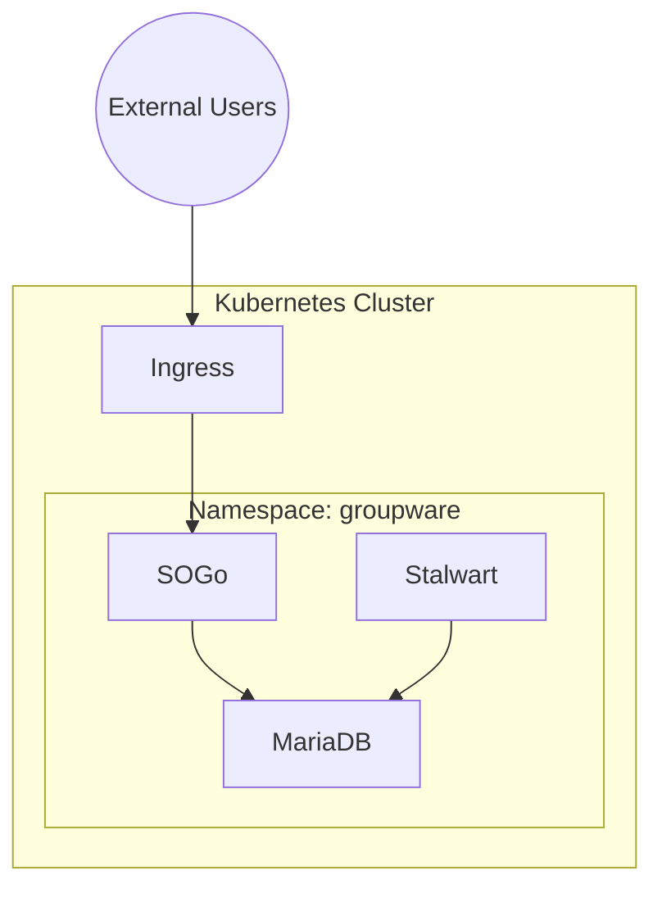

# Advanced Example: Multi-Service Groupware Stack

This example demonstrates how to deploy a complete groupware stack with database, mail server, and groupware service.

## Overview



## Architecture

| Component | Image | Purpose | Ports |
|-----------|-------|---------|-------|
| **MariaDB** | `mariadb:11.4.4` | Database backend | 3306 |
| **Stalwart** | `stalwart/stalwart:latest` | Mail server (SMTP/IMAP/JMAP) | 25, 143, 8080 |
| **SOGo** | `sogo6:latest` | Groupware (ActiveSync/CalDAV/CardDAV) | 80 |
| **Ingress** | `nginx` | External access with TLS | 443 |

## Components

### 1. MariaDB Database

- **Version**: 11.4.4
- **Storage**: 10Gi PersistentVolume
- **Credentials**: Kubernetes Secret
- **Health Checks**: TCP liveness/readiness probes

### 2. Stalwart Mail Server

- **Protocol**: SMTP, IMAP, JMAP
- **Database**: SQLite (embedded)
- **JWT**: Secret-based authentication
- **Resources**: 256Mi-512Mi memory

### 3. SOGo Groupware

- **Version**: SOGo 6
- **Backend**: MariaDB
- **Replicas**: 2 (high availability)
- **Protocols**: ActiveSync, CalDAV, CardDAV, WebDAV

### 4. Network Policies

- **Ingress**: Only from ingress-nginx namespace
- **Egress**: MariaDB (3306), DNS (53)
- **Default**: Deny all other traffic

## Usage

### Build and Deploy

```bash
# Build manifests
nix build .#packages.x86_64-linux.groupware-stack

# Deploy to cluster
kubectl apply -f result/

# Verify deployment
kubectl get pods -n groupware
kubectl get svc -n groupware
```

### Expected Output

```
NAME                         READY   STATUS    RESTARTS   AGE
mariadb-6d4b8f9c7-x2k4m     1/1     Running   0          2m
stalwart-7f8c9d5e6-n3j5l    1/1     Running   0          2m
sogo-5c6d7e8f9-a1b2c        1/1     Running   0          2m
sogo-5c6d7e8f9-d3e4f        1/1     Running   0          2m

NAME         TYPE        CLUSTER-IP      EXTERNAL-IP   PORT(S)             AGE
mariadb      ClusterIP   10.96.100.1     <none>        3306/TCP            2m
stalwart     ClusterIP   10.96.100.2     <none>        25/TCP,143/TCP,8080/TCP  2m
sogo         ClusterIP   10.96.100.3     <none>        80/TCP              2m
```

### Configure Ingress

Update the ingress host in `flake.nix`:

```nix
ingress = {
  # ...
  spec = {
    tls = [
      {
        hosts = [ "groupware.your-domain.org" ];  # Change this
        secretName = "groupware-tls";
      }
    ];
    rules = [
      {
        host = "groupware.your-domain.org";  # Change this
        # ...
      }
    ];
  };
};
```

### Create TLS Secret

```bash
# Generate self-signed certificate (for testing)
openssl req -x509 -nodes -days 365 -newkey rsa:2048 \
  -keyout tls.key -out tls.crt \
  -subj "/CN=groupware.your-domain.org"

# Create Kubernetes secret
kubectl create secret tls groupware-tls \
  --cert=tls.crt --key=tls.key \
  -n groupware
```

## Customization

### Change Database Credentials

```nix
mariadbSecret = {
  # ...
  stringData = {
    "root-password" = "your-root-password";
    "sogo-password" = "your-sogo-password";
  };
};
```

### Adjust Resource Limits

```nix
resources = {
  requests = {
    memory = "1Gi";    # More memory
    cpu = "500m";      # More CPU
  };
  limits = {
    memory = "2Gi";    # Higher limit
    cpu = "2000m";     # Higher limit
  };
};
```

### Add SOGo Replicas

```nix
sogoDeployment.spec.replicas = 3;  # Increase from 2 to 3
```

### Enable Persistent Storage for Stalwart

```nix
stalwartDeployment.spec.template.spec.containers = [
  {
    # ...
    volumeMounts = [
      {
        name = "data";
        mountPath = "/data";
      }
    ];
  }
];

stalwartDeployment.spec.template.spec.volumes = [
  {
    name = "data";
    persistentVolumeClaim = { claimName = "stalwart-data"; };
  }
];
```

## Security Considerations

### Production Hardening

1. **Change All Secrets**: Update default passwords
2. **Enable TLS**: Use valid certificates
3. **Network Policies**: Review and restrict traffic
4. **Resource Limits**: Set appropriate limits
5. **Pod Security**: Enable Pod Security Standards

### Secrets Management

For production, use external secrets management:

```nix
# Use External Secrets Operator
mariadbSecret = {
  apiVersion = "external-secrets.io/v1beta1";
  kind = "ExternalSecret";
  metadata.name = "mariadb-credentials";
  spec = {
    secretStoreRef = {
      name = "aws-secrets-manager";
      kind = "SecretStore";
    };
    target = {
      name = "mariadb-credentials";
      creationPolicy = "Owner";
    };
    data = [
      {
        secretKey = "root-password";
        remoteRef = {
          key = "opendesk/mariadb";
          property = "root-password";
        };
      }
    ];
  };
};
```

## Monitoring

### Prometheus Metrics

Add Prometheus annotations:

```nix
mariadbDeployment.spec.template.metadata.annotations = {
  "prometheus.io/scrape" = "true";
  "prometheus.io/port" = "9104";
  "prometheus.io/path" = "/metrics";
};
```

### Grafana Dashboard

Import the groupware dashboard:

```bash
kubectl apply -f https://grafana.com/api/dashboards/12345/revisions/1/download
```

## Troubleshooting

### Check Pod Logs

```bash
# MariaDB
kubectl logs -n groupware -l app=mariadb

# Stalwart
kubectl logs -n groupware -l app=stalwart

# SOGo
kubectl logs -n groupware -l app=sogo
```

### Check Service Connectivity

```bash
# Test MariaDB
kubectl run test --rm -it --image=mariadb:11.4.4 -n groupware -- \
  mysql -h mariadb -u sogo -p

# Test SOGo
kubectl run test --rm -it --image=curlimages/curl -n groupware -- \
  curl http://sogo:80/SOGo/soap/health
```

### Check Network Policies

```bash
# List network policies
kubectl get networkpolicy -n groupware

# Describe network policy
kubectl describe networkpolicy groupware-network-policy -n groupware
```

## Next Steps

1. **Add Monitoring**: Deploy Prometheus + Grafana
2. **Add Backup**: Configure database backups
3. **Add HA**: Deploy multiple SOGo replicas
4. **Add Authentication**: Integrate with Identity Provider
5. **Add Compliance**: Enable Kyverno policies

## Related Examples

- [Basic](../basic/) - Single service deployment
- [Compliance](../compliance/) - ZKI-Compliance setup
- [Production](../production/) - Full production deployment

## License

This example is part of openDesk Edu and is licensed under the Apache License 2.0.
