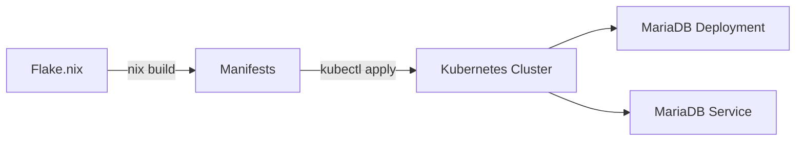

# Basic Example: Single Service Deployment

This example demonstrates how to deploy a single service (MariaDB) to Kubernetes using openDesk Edu libraries.

## Overview



## Architecture

- **Deployment**: MariaDB 11.4.4 with resource limits
- **Service**: ClusterIP service exposing port 3306
- **Security**: Non-root user, read-only filesystem

## Usage

### Build Manifests

```bash
# Build combined manifest
nix build .#packages.x86_64-linux.mariadb-all

# Output: result/mariadb-all.yaml
```

### Deploy to Cluster

```bash
# Apply to Kubernetes
kubectl apply -f result/

# Verify deployment
kubectl get pods -l app=mariadb
kubectl get svc mariadb
```

### Test Connection

```bash
# Test from within cluster
kubectl run test --rm -it --image=mariadb:11.4.4 --namespace=default -- \
  mysql -h mariadb -u root

# Or use port-forward
kubectl port-forward svc/mariadb 3306:3306
mysql -h 127.0.0.1 -P 3306 -u root
```

## Manifest Structure

### Deployment

```yaml
apiVersion: apps/v1
kind: Deployment
metadata:
  name: mariadb
  labels:
    app: mariadb
    app.kubernetes.io/name: mariadb
spec:
  replicas: 1
  selector:
    matchLabels:
      app: mariadb
  template:
    metadata:
      labels:
        app: mariadb
    spec:
      containers:
        - name: mariadb
          image: mariadb:11.4.4
          ports:
            - containerPort: 3306
          resources:
            requests:
              memory: 512Mi
              cpu: 250m
            limits:
              memory: 1Gi
              cpu: 1000m
          securityContext:
            runAsNonRoot: true
            runAsUser: 999
            readOnlyRootFilesystem: true
```

### Service

```yaml
apiVersion: v1
kind: Service
metadata:
  name: mariadb
  labels:
    app: mariadb
    app.kubernetes.io/name: mariadb
spec:
  selector:
    app: mariadb
  type: ClusterIP
  ports:
    - name: mysql
      port: 3306
      targetPort: 3306
```

## Customization

### Change Image Version

Edit `flake.nix`:

```nix
mariadb = {
  name = "mariadb";
  image = "mariadb:11.5.2";  # New version
  # ...
};
```

### Adjust Resources

```nix
mariadb = {
  # ...
  resources = {
    memory = "1Gi";        # More memory
    cpu = "500m";          # More CPU
    memoryLimit = "2Gi";   # Higher limit
    cpuLimit = "2000m";    # Higher limit
  };
};
```

### Add Environment Variables

```nix
mkDeployment = { name, image, ports, env ? [] }: {
  # ...
  spec.template.spec.containers = [
    {
      # ...
      env = map (e: { name = e.name; value = e.value; }) env;
    }
  ];
};

mariadb = {
  # ...
  env = [
    { name = "MYSQL_ROOT_PASSWORD"; value = "secret"; }
  ];
};
```

## Next Steps

1. **Add Persistence**: Create PersistentVolumeClaim for data
2. **Add Secrets**: Store credentials in Kubernetes Secret
3. **Add Health Checks**: Configure liveness/readiness probes
4. **Add Monitoring**: Configure Prometheus metrics

## Related Examples

- [Advanced](../advanced/) - Multi-service stack
- [Compliance](../compliance/) - ZKI-Compliance setup
- [Production](../production/) - Full production deployment

## Troubleshooting

### Pod not starting

```bash
# Check pod status
kubectl describe pod -l app=mariadb

# Check logs
kubectl logs -l app=mariadb
```

### Service not reachable

```bash
# Check service endpoints
kubectl get endpoints mariadb

# Check network policies
kubectl get networkpolicy -n default
```

## License

This example is part of openDesk Edu and is licensed under the Apache License 2.0.
