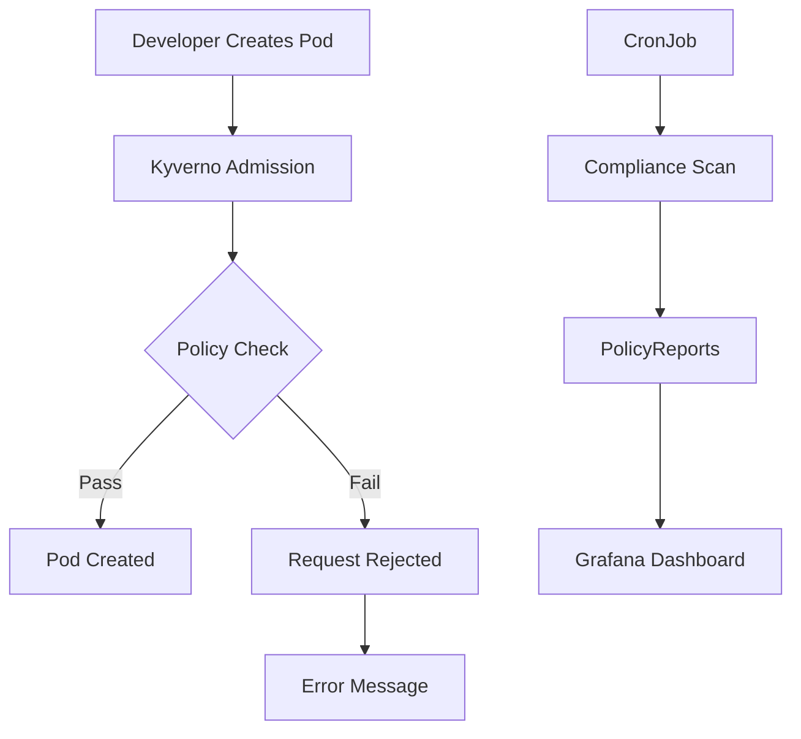

# Compliance Example: ZKI-IT-Grundschutz Kyverno Policies

This example demonstrates how to deploy Kyverno policies for automated ZKI-IT-Grundschutz compliance enforcement.

## Overview



## Compliance Mapping

| Policy | ZKI-ID | BSI-Baustein | Description |
|--------|--------|--------------|-------------|
| require-non-root | INF.1.A10 | Zugriffskontrolle | Containers must run as non-root |
| require-network-policy | INF.5.A1 | Netzwerksicherheit | Network segmentation required |
| require-labels | INF.1.A15 | Audit | Resource labeling for tracking |
| require-resource-limits | APP.3.A1 | Anwendungssicherheit | Resource limits prevent exhaustion |
| verify-image-signatures | SUPPLY-CHAIN-001 | Supply Chain | Image signature verification |
| read-only-rootfs | INF.1.A10 | Zugriffskontrolle | Immutable filesystem |
| drop-capabilities | INF.1.A10 | Zugriffskontrolle | Minimal privileges |

## Policies

### 1. Require Non-Root Containers

**ZKI-ID:** INF.1.A10  
**Action:** enforce

Prevents privilege escalation by requiring all containers to run as non-root users.

```yaml
# Enforces: securityContext.runAsNonRoot = true
apiVersion: kyverno.io/v1
kind: ClusterPolicy
metadata:
  name: require-non-root
spec:
  validationFailureAction: enforce
  rules:
    - name: run-as-non-root
      validate:
        message: "Containers must run as non-root user."
        pattern:
          spec:
            securityContext:
              runAsNonRoot: true
```

### 2. Require Network Policies

**ZKI-ID:** INF.5.A1  
**Action:** audit

Ensures all namespaces have network policies for segmentation.

```yaml
apiVersion: kyverno.io/v1
kind: ClusterPolicy
metadata:
  name: require-network-policy
spec:
  validationFailureAction: audit
  rules:
    - name: check-network-policy
      validate:
        message: "Namespace must have network policies."
```

### 3. Require Resource Labels

**ZKI-ID:** INF.1.A15  
**Action:** enforce

Mandates labeling for audit and tracking purposes.

```yaml
apiVersion: kyverno.io/v1
kind: ClusterPolicy
metadata:
  name: require-resource-labels
spec:
  validationFailureAction: enforce
  rules:
    - name: check-app-label
      validate:
        message: "Resource must have 'app' label."
        pattern:
          metadata:
            labels:
              app: "?*"
```

### 4. Require Resource Limits

**ZKI-ID:** APP.3.A1  
**Action:** enforce

Prevents resource exhaustion attacks.

```yaml
apiVersion: kyverno.io/v1
kind: ClusterPolicy
metadata:
  name: require-resource-limits
spec:
  validationFailureAction: enforce
  rules:
    - name: check-cpu-limits
      validate:
        message: "Containers must have CPU limits."
    - name: check-memory-limits
      validate:
        message: "Containers must have memory limits."
```

### 5. Verify Image Signatures

**ZKI-ID:** SUPPLY-CHAIN-001  
**Action:** enforce

Ensures only signed images from trusted registries are deployed.

```yaml
apiVersion: kyverno.io/v1beta1
kind: ClusterPolicy
metadata:
  name: verify-image-signatures
spec:
  validationFailureAction: enforce
  rules:
    - name: check-signatures
      verifyImages:
        - registry: registry.opencode.de/umr/opendesk-edu/opendesk-nix/
          attestations:
            - predicateType: "https://slsa.dev/provenance/v0.2"
```

### 6. Require Read-Only Root Filesystem

**ZKI-ID:** INF.1.A10  
**Action:** enforce

Prevents unauthorized filesystem modifications.

```yaml
apiVersion: kyverno.io/v1
kind: ClusterPolicy
metadata:
  name: require-read-only-rootfs
spec:
  validationFailureAction: enforce
  rules:
    - name: read-only-rootfs
      validate:
        message: "Containers must use read-only root filesystem."
        pattern:
          spec:
            securityContext:
              readOnlyRootFilesystem: true
```

### 7. Drop All Capabilities

**ZKI-ID:** INF.1.A10  
**Action:** enforce

Ensures minimal container privileges.

```yaml
apiVersion: kyverno.io/v1
kind: ClusterPolicy
metadata:
  name: drop-all-capabilities
spec:
  validationFailureAction: enforce
  rules:
    - name: drop-all
      validate:
        message: "Containers must drop all capabilities."
        pattern:
          spec:
            securityContext:
              capabilities:
                drop:
                  - ALL
```

## Usage

### Deploy Policies

```bash
# Build and deploy all policies
nix build .#packages.x86_64-linux.compliance-policies
kubectl apply -f result/

# Verify policies are active
kubectl get clusterpolicies
```

### Expected Output

```
NAME                         VALIDATIONACTION   BACKGROUND   READY
require-non-root             Enforce            true         true
require-network-policy       Audit              true         true
require-resource-labels      Enforce            true         true
require-resource-limits      Enforce            true         true
verify-image-signatures      Enforce            false        true
require-read-only-rootfs     Enforce            true         true
drop-all-capabilities        Enforce            true         true
```

### Check Compliance Status

```bash
# View all policy reports
kubectl get policyreports --all-namespaces

# View cluster-wide compliance
kubectl get clusterpolicyreports -o wide

# Check specific policy violations
kubectl get clusterpolicyreports -o jsonpath='{.items[*].spec.policy}' | sort | uniq -c
```

### Test Policy Enforcement

```bash
# This should FAIL (no resource limits)
cat <<EOF | kubectl apply -f -
apiVersion: v1
kind: Pod
metadata:
  name: test-no-limits
  labels:
    app: test
spec:
  containers:
    - name: nginx
      image: nginx:latest
EOF

# This should PASS (with all requirements)
cat <<EOF | kubectl apply -f -
apiVersion: v1
kind: Pod
metadata:
  name: test-compliant
  labels:
    app: test
spec:
  securityContext:
    runAsNonRoot: true
    readOnlyRootFilesystem: true
    capabilities:
      drop:
        - ALL
  containers:
    - name: nginx
      image: registry.opencode.de/umr/opendesk-edu/opendesk-nix/nginx:latest
      resources:
        requests:
          memory: "64Mi"
          cpu: "250m"
        limits:
          memory: "128Mi"
          cpu: "500m"
      securityContext:
        runAsNonRoot: true
        readOnlyRootFilesystem: true
        capabilities:
          drop:
            - ALL
EOF
```

## Compliance Dashboard

### Grafana Integration

Import the Kyverno compliance dashboard:

```bash
# Download dashboard
curl -O https://raw.githubusercontent.com/kyverno/kyverno/main/charts/kyverno-policies/dashboards/compliance-dashboard.json

# Import to Grafana
grafana-cli plugins install grafana-kubernetes-app
```

### Prometheus Metrics

```bash
# Query compliance score
curl -s http://kyverno-metrics:8000/metrics | grep kyverno_policy_rule_result_total

# Create alert for violations
cat <<EOF | kubectl apply -f -
apiVersion: monitoring.coreos.com/v1
kind: PrometheusRule
metadata:
  name: kyverno-violations
  namespace: monitoring
spec:
  groups:
    - name: kyverno
      rules:
        - alert: KyvernoPolicyViolation
          expr: kyverno_policy_rule_result_total{result="fail"} > 0
          for: 5m
          labels:
            severity: warning
          annotations:
            summary: "Kyverno policy violation detected"
EOF
```

## Customization

### Add Custom Policies

```nix
customPolicy = {
  apiVersion = "kyverno.io/v1";
  kind = "ClusterPolicy";
  metadata.name = "my-custom-policy";
  spec = {
    validationFailureAction = "enforce";
    rules = [
      {
        name = "my-rule";
        validate = {
          message = "Custom validation message";
          pattern = { /* ... */ };
        };
      }
    ];
  };
};

# Add to allPolicies
allPolicies = pkgs.writeText "compliance-policies.yaml" ''
  ---
  ${builtins.toJSON requireNonRootPolicy}
  ---
  ${builtins.toJSON customPolicy}
'';
```

### Change Policy Action

```nix
# Change from enforce to audit for testing
requireNonRootPolicy.spec.validationFailureAction = "audit";
```

### Exclude Namespaces

```nix
requireNonRootPolicy.spec.rules = [
  {
    name = "run-as-non-root";
    match = {
      any = [
        {
          resources = {
            kinds = [ "Pod" ];
            excludeNamespaces = [ "kube-system" "kyverno" ];
          };
        }
      ];
    };
  }
];
```

## Troubleshooting

### Check Policy Status

```bash
# Describe policy
kubectl describe clusterpolicy require-non-root

# Check policy mutations
kubectl get clusterpolicyrequire-non-root -o yaml
```

### View Policy Reports

```bash
# Get all violations
kubectl get policyreports --all-namespaces -o json | \
  jq '.items[] | select(.status.results[]?.result == "fail")'

# Get compliance score
kubectl get clusterpolicyreports -o jsonpath='{.items[0].status.summary}'
```

### Test Individual Policy

```bash
# Use kyverno CLI for testing
kyverno apply policies/require-non-root.yaml \
  --resource pod.yaml \
  --output results.json
```

## Compliance Score

Calculate overall compliance:

```bash
#!/bin/bash
# compliance-score.sh

TOTAL_RULES=0
PASSED_RULES=0

for report in $(kubectl get clusterpolicyreports -o name); do
    TOTAL=$(kubectl get $report -o jsonpath='{.status.summary.rulescount}')
    PASS=$(kubectl get $report -o jsonpath='{.status.summary.passed}')
    TOTAL_RULES=$((TOTAL_RULES + TOTAL))
    PASSED_RULES=$((PASSED_RULES + PASS))
done

SCORE=$((PASSED_RULES * 100 / TOTAL_RULES))
echo "Compliance Score: ${SCORE}%"
echo "Passed: ${PASSED_RULES}/${TOTAL_RULES} rules"
```

## Next Steps

1. **Enable Enforcement**: Change audit policies to enforce
2. **Add More Policies**: Extend compliance coverage
3. **Automate Scans**: Schedule daily compliance checks
4. **Integrate SIEM**: Forward violations to security monitoring
5. **Document Exceptions**: Create exception process for legitimate cases

## Related Examples

- [Basic](../basic/) - Single service deployment
- [Advanced](../advanced/) - Multi-service stack
- [Production](../production/) - Full production deployment

## License

This example is part of openDesk Edu and is licensed under the Apache License 2.0.
